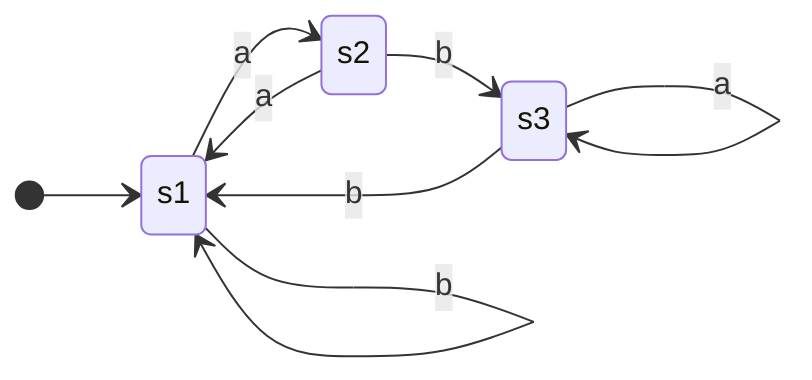

Automata theory is a branch of [[Computability Theory|computability theory]] which use automatons to provide a model of computation. These automata function as an abstraction on a machine which moves around states based upon a given set of inputs. Formally automata are a 5-tuple consisting of a set of states $Q$, an input alphabet $\Sigma$, rules for moving, start states, and accept states. The **transition function** $\delta$ is used to denote the rules of moving, and thus maps the states to each other based upon the alphabet. The transition function is commonly called as $\delta(s,t)$, where $s$ is the state, and $c$ is a character within the machine's alphabet. Mathematically this can be seen as $\delta:Q\times\Sigma\rightarrow Q$. The accept state is an acceptable end state for the finite automata. While they can transition from accept states upon termination they must be within an accept state, thus the accept state $F$ is a subset of all states $F\subseteq Q$. Finally the start state can be simply represented as $q_0\in Q$. 

Automatons can be sub-classified based upon the traits it exhibits. **Finite automata** add an extra condition on automata, and that is a finite set of states and transitions. This is as opposed to **Non-Finite automata** which lack this characteristic. 

The **complement** of a state machine can simply be found by converting all accepted states into non-accepted states and all non-accepted states into accepted states.

**Kleene's Theorem** states that any language that can be defined by [[Formal Languages#Regular Languages|regular expressions]], finite automata, non-deterministic finite automata, and generalised non-deterministic finite automata can be defined by each other. This means conversions from NFA to GFA, or REGEX to DFA exists for any inputs.

# NFA vs DFA
**Deterministic Finite Automata** (DFA) are finite automata that only have one valid result for a transition function. This means there operation is predictable as a series of steps. **Non-Deterministic automata** have a transition function which maps to multiple values. This distinction allows branches in the state which may result in a different paths being taken. Formally the transition function is defined as the [[Set Theory|power set]] of possible states or $\delta:\mathcal{Q}\times\Sigma_\varepsilon\to\mathcal{P}(\mathcal{Q})$ with the alphabet being the union between itself and an empty character $\Sigma\cup\{\varepsilon\}$.

# GNFA
**Generalized Finite Automata** is defined as an NFA with a transition function that can be defined with regular expressions. The allowance of regular expressions within finite automata enables multiple characters as well as infinite languages to be interpreted. In addition to these rules a standard GNFA has only 1 start and 1 end state, with no ability for the state to go back to the starting state.

# Pushdown Automata
Pushdown automata are a type of Non-Deterministic finite automata that employs a stack as a form of memory. Pushdown automata allow for [[Formal Languages#Context-Free Languages|context-free languages]] to be recognized in addition to languages recognized by a NFA. This is due to the presence of the stack which allows the stack's top to be able to effect transitions and be effected by transitions. Informally pushdown automata when reading are able to reflect upon the previous character as to modify the transition function which allows for more complex operations. In general pushdown automata are non-deterministic unless specified.

Formally pushdown automata can be defined as a $7$ tuple $M=(Q,\Sigma,\Gamma,\delta,Q_0,Z,F)$ where:
- $Q$ is a finite set of states.
- $\Sigma$ is a finite set which is the input alphabet.
- $\Gamma$ is a finite set which is the stack alphabet.
- $\delta$ is a finite subset of $Q\times(\Sigma\cup\{\varepsilon\})\times\Gamma\times Q\times\Gamma^*$, the transition relation.
- $q_0\in Q$ is the start state.
- $Z\in\Gamma$ is the initial stack symbol.
- $F\subseteq Q$ is the set of accepting states.

Pushdown automata can be transformed into an equivalent pushdown automaton.
# Modelling
Automata are commonly described with **state diagrams**. These diagrams model states with vertices and transitions with edges.

An alternative representation of finite automata is the use of a table to map the transition of states. The representation below is equivalent to the above state diagram.

| State | a | b |
| --- | --- | --- |
| **S1** | S2 | S1 |
| **S2** | S1 | S3 |
| **S3** | S3 | S1 |

**Pushdown Automata** are modelled similar to FA's except with the addition of a command which states the symbol to push and pop. This means transitions are represented as $x,y\to z$, where $x$ is the read symbol, $y$ is the pop symbol, and $z$ is the push symbol.
