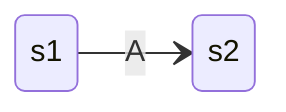
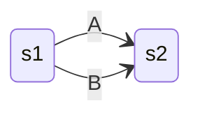
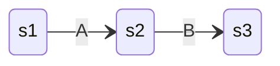
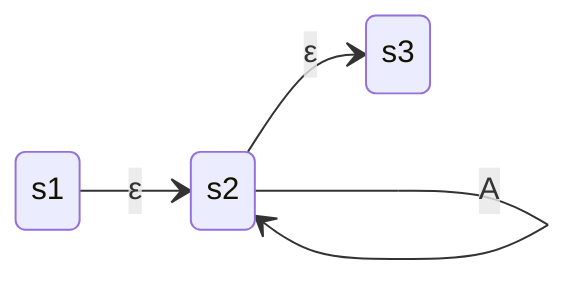
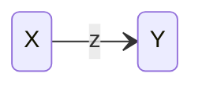
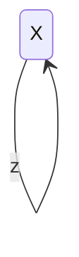
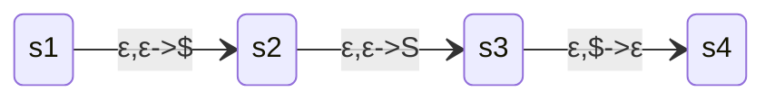

εKleene's theorem states that any language which can be defined by regular expressions, finite automata, non-deterministic finite automata, and generalized finite automata can be defined by any other method. This process follows a conversion of regular expressions into NFA, NFA into DFA, and DFA into GNFA.

# Converting Regex to NFA
[[Formal Languages#Regular Languages|Regular Languages]] can be converted into a [[Automata Theory#NFA vs DFA|Non-Deterministic Finite Automata]] through the conversion of regular language operations into transition operations.
- Basic terms $(A)$ are simply converted into a state transition.

- Alternation $A\cup B$ is converted by creating a transition from one state to the next state through either $A$ or $B$. 

- Concatenation $AB$ is handled through the creation of an state intermediate state.

- Kleene start $A*$ is handled through adding a recursive call to the state.

# Converting NFA to FA
[[Automata Theory#NFA vs DFA|Non-Deterministic Finite Automata]] can be converted into [[Automata Theory#NFA vs DFA|Finite Automata]] through the creation of a new state table. This is done through finding the end states of a particular input string. This input string starts as an empty character $\text{endStates}(\varepsilon)$, and then builds up $\text{endStates}(a)$, $\text{endStates}(ab)$ as to find the pattern of states. This results in each end state call returning a set of possible states it could end up at. This means in general given a string $w$ and a character $x$ we find that 
$$\text{endStates}(wx)=\{q: \text{ for some state }p\in\text{endStates}(w)\text{ there is a transition state }p\to^x q\}$$
Provided no empty transition. This process of constructing a string $wx$ continues until no new sets a found. From this a finite state machine is able to be constructed with each state represented by a set of states from the NFA. For empty transitions the set has extra elements added to it. 

# FA Simplification
When converting a NFA to an FA it is very common or additional unnecessary states to be added. To remove this a process of simplification can be done. This process involves labeling all final states with one colour and all non-finals with another colour. Then for each colour used so far if their row doesn't have the same pattern of colours then give each different row pattern a different colour using a new colour. This continues until no new colours can be added. These colours then can be converted into a transition table.

# Converting FA to GNFA
[[Automata Theory#NFA vs DFA|Finite Automata]] can be converted into [[Automata Theory#GNFA|Generalized Non-Finite Automata]] through the simple process of ensuring there is 1 final state. This usually involves adding a blank string which connects all accepted states to a super sink and the same with the starting state adding a blank string which connects to the super starting state. Outside of this the GNFA will be considered valid.

The GNFA can be simplified through writing regular expressions to replace the state transitions. More information on this will be provided in the next section.

# Converting GNFA to Regex
Converting [[Automata Theory#GNFA|Generalized Non-Finite Automata]] a [[Formal Languages#Regular Languages|Regular expression]] follows a simple process of turning all the edges and states between the start and end state into a single transition between the two.  To do this build up a regular expression transition function that explains all the possible ways to get from one state to another with the transition functions. Keep track of which edges are being used as once all valid combinations of the edges are used the edge and state can be removed. This simplifies the automaton allowing for further simplification using these regular expressions. Continue this until only one edge between the start and end remains.

# Conversions Using CFA's & PDA's
## NFA to CFA
The process of converting an NFA to a CFA follows a basic process of naming each state after a non-terminal. The following NFA produces an expression of $X\to zY$, additionally an empty transition means $X\to Y$:

The next NFA produces a CFG of $X\to zX$:

The final accepting state can be seen as $X\to \varepsilon$.

# CFG to PDA
The conversion from context-free grammar to pushdown automata usually follows a process of creating transitions $x,y\to z$, where $x$ is a terminal found within the rule, $y$ is the current non-terminal, and $z$ is the leftmost non-terminal. For example the rule $X\to aY$ can be represented as $a,X\to Y$. For rules with multiple terminals and non-terminals you create extra states. This should result in a pattern of the first transitions reading the terminals on the left side, before adding the right side non-terminals to the stack. Additionally all machines follow a basic structure of:

Where `s3` is the state which the grammar bases all its transitions off.

# PDA to CFG
Before a PDA can be converted to a CFG it first must ensure that it has  just one final state, and the stack is empty once it reaches that state. Additionally states can only push or pop, not both. Meaning the transition states must be of the  form $Y\to\varepsilon$ or $\varepsilon\to Y$. After this for every pair of states define $A_{pq}$ non-terminal and for every one generate a rule from starting at $p$ with an empty stack and ending at $q$ with an empty stack. There are two cases as a result of this:
- **Case 1:** the computation has an empty stack before reaching $q$. This implies that it reaches a non-terminal in-between and thus we find rule $A_{pq}\to A_{pr}A_{rq}$.
- **Case 2:** the computation never has an empty stack except at $q$. This means there is a non-terminal in-between terminals. To model this check if there is a sub-stack between $p'$ to $q'$ which has a stack which is empty at the start and end, ignoring elements that were on $p'$ before. This can be modeled as $A_{pq}\to xA_{p'q'}y$.

Finally for each state add production $A_{pp}\to\varepsilon$ and $A_{st}\to S$, where $s$ is the starting node, and $t$ is the end.
