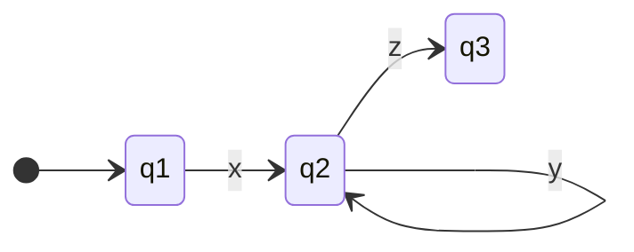

The pumping lemma is a strategy for determining non-regular and non-context free languages. This works of the intuition that a regular/context-free language requires the ability to be **pumped** if they are at least as long as the **pumping-length**. This means that each string contains a section that can be repeated any number of times with the resulting string staying within the language. By proving that it can't be pumped it contradicts its initial language classification. 

Using the pumping lemma follows the process of using a [[Proofs#Proof by Contradiction|proof by contradiction]] to assume the language's type. Then state that there exists a pumping length $N$ for which all strings can be pumped. Next find a string of greater than length $N$ that can't be pumped. Finally demonstrate that it can't be pumped given all ways of dividing it into its parts. Thus, finding a value of $i$ for each division where it isn't in the language. Usually the process of writing these proofs requires analysis of many different cases using the rule's of the language to disprove cases.

# Pumping Lemma for Regular Languages
The pumping lemma for [[Formal Languages#Regular Languages|regular languages]] attempts to classify if a language is regular. Formally if $A$ is a regular language then there is a number $N$ (the pumping length) where if $w\in L$ is a valid string within the language of length $N$ or more then $w$ may be divided into three parts. These parts are:
$$w=xyz$$
Where for each $i\geq0$, there exists a valid string $xy^iz\in L$. With $|y|>0$ and $|xy|\leq N$. This means $xz,xyz,xyyz,\dots,xy^nz,\dots\in L$. Symbolically this can be viewed as:
$$\forall w\in L:|w|\geq N \Rightarrow\big(\exists x,y,z : (w=xyz)\land(y\neq\varepsilon)\land(|x|+|y|\leq N)\land(\forall i\geq0: xy^iz\in L)\big)$$
What this means for the [[Automata Theory|finite automaton]] is that there exists a path $x$ from the start node to another node. And then there is a path $y$ that loops around to the same node $i$ times, and finally there is a path to the accept state. Graphically this can be viewed as:

# Pumping Lemma for Context-Free Languages
The pumping lemma for [[Formal Languages#Context-Free Languages|context-free languages]] attempts to classify if a language is context-free. Formally if $A$ is a context-free language then there is a number $N$ where if $w\in L$ is a valid string within the language of length $N$ or more then $w$ may be divided into five parts. These are: 
$$w=uvxyz$$
Where for each $i\geq0$ there exists a valid string $uv^ixy^iz\in L$. With $|vy|>0$ and $|vxy|<N$. This means that there are two loops that are separated by a segment $x$.
