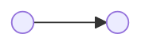
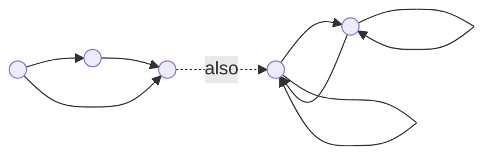

A **binary relation** on a set defines some relation between the elements of two [[Set Theory|sets]]. A relation is defined as:
$$\{ (x,y):x \in X \text{ and } y \in Y\}$$
Where $(x,y)$ are related pairs. A common form of notation is written as $xRy$ where $R$ is any letter used to define the relation. Contrastingly $x\not R y$ defines no relation. Keep in mind that if $xRy \text{ and } yRz$ exist, this doesn't necessarily mean $xRz$ exists.

Any [[Functions|function]] $f:X \rightarrow Y$ can be viewed as a relation $R$ on $X \cup Y$. However, not every relation is **one-to-one** therefore not every relation is a function.

# Relation Properties
A relation can have any of the following properties:
- **Reflexive** which is defined as $aRa$ for all $a\in A$.

- **Symmetric** which is defined as $\text{if }aRb \text{ then } bRa$ for all $a,b \in A$.

- **Asymmetric** which is defined as $\text{if }aRb \text{ then } b\not Ra$ for all $a,b \in A$.

- **Transitive** which is defined as $\text{if }aRb \text{ \& } bRc \text{ then } aRc$ for all $a,b,c \in A$.

- **Antisymmetric** is defined as $\text{if } aRb \text{ \& } bRa \text{ then } x=y$ for all $a,b \in A$. Another way to define it is $\text{if } (x,y) \notin R \text{ or } (y,x) \notin R \text{ when } x\neq y$.

# Equivalence Relation
An equivalence relation is a binary relation that is **reflexive**, **symmetric** and **transitive**. The equivalence class can be defined as:
$$ [a] = \{ s \in S : sRa\}$$
If an equivalence relation is done on a set, then the **equivalence class** is a [[Set Theory#Partition|partition]] of the set. Two elements are related if in the same **equivalence class**.

# Order Relation
A **partial order relation** is a binary relation that is **reflexive**, **antisymmetric**, and **transitive**.

A **total order relation** is a kind of partial order relation that puts everything in order. Thus, it has the same relation properties as well as the property $aRb \text{ or } bRa$ for all $a,b \in A$. A **Hasse diagram** can be used to represent a partial order relation. Where the bottom of the diagram is the start, and the top is the end.

A **well-order relation** on a set is a total order relation that also has the property that each nonempty set contains at least one element. A Hasse diagram of this would be a single line.
